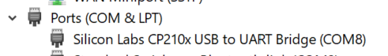
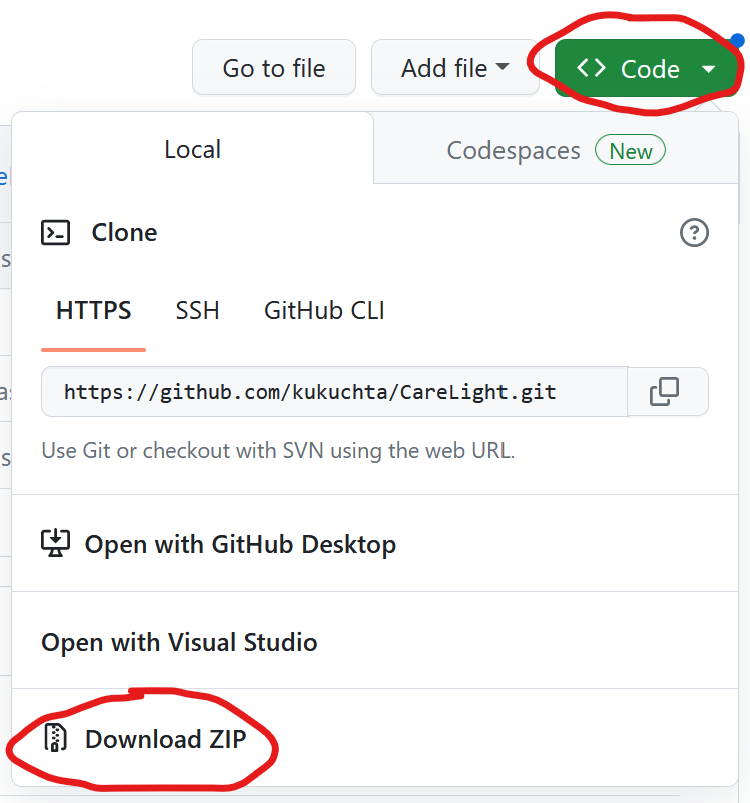
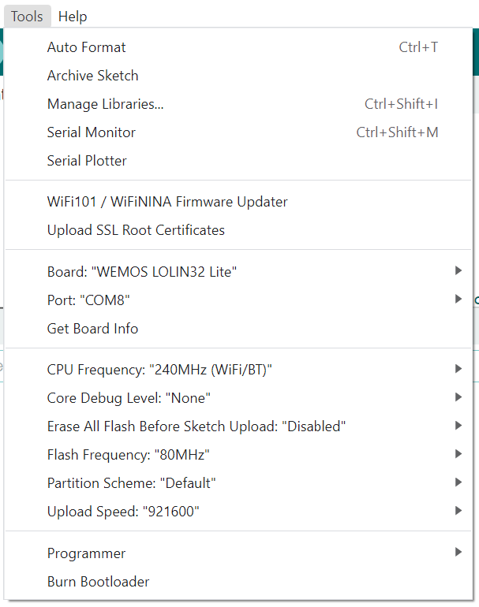

# Setup
There are several steps to setup working CareLight. They will be described for ESP-WROOM-32 main board as it requires least effort.

## Hardware assembly
To avoid any soldering, make sure that you buy boards from manufacturer that provides already soldered modules. Often they come with goldpins just thrown into a bag with the module.

Use three female to female DuPont wires to make connections:
* GND on main board to ground of the LED board (G/GND/V-)
* VIN on main board to positive voltage of the LED board (VCC/+5V/V+)
* D12 on main board to data input of the LED board (DIN/IN/INPUT)

## Programming

1. Connect main board to the computer with mini USB cable to check if it is recognized as COM port.
  * Find in menu Start and open the Device Manager
  * Look under Ports (COM & LPT) for:
  
    
  * If it is there, then go to next step. If there is an unrecognized device, you should download and install "CP210x Universal Windows Driver" from Silabs page [here](https://www.silabs.com/developers/usb-to-uart-bridge-vcp-drivers?tab=downloads), and reconnect the board to USB.
2. Download and install Arduino IDE version at least 2.0.4 from [here](https://www.arduino.cc/en/software).
3. Install ESP32 Arduino Core boards support as explained [here](https://docs.espressif.com/projects/arduino-esp32/en/latest/installing.html).
4. Install Arduino libraries:
  * FastLED by Daniel Garcia v3.5
  * ArduinoJson by Benoit Blanchon v6.21.1
  * StreamUtils by Benoit Blanchon v1.7.3
5. Download CareLight source code from this repository:

    
    
6. Open CareLink.ino with Arduino IDE
7. Setup following parameters under Tools menu:

    
    
  Where Port should be the COM port number fonund earlier in the Windows Device Manager.
8. Hit upload button.

## Setting up

Setting up all the parameters for CareLight is done through COM port. With Arduino IDE opened and CareLink board connected through USB: 
1. Open the Serial Monitor (menu Tools/Serial Monitor) 
2. Change connection speed to 115200 baud
3. Click into the Message field
4. Reset the board by pressing EN or RST button
5. When the round CareLight logo is displayed on the LED board press Enter key to send empty message through COM port. It causes the board the Setup mode. If board is starting for the first time after programming it will enter Setup by default.
6. Follow messages displayed in Serial Monitor and confirm every setting with Enter key. The default or current value of every setting will be used if no new value is provided (just press Enter). 
7. When choosing colors, CareLight displays them and asks for confirmation. It is possible to try several colors before confirming the choosen one. 
8. In case of entering wrong value reset the board and just start again from the beginning.

After updating last parameter the device saves configuration in Flash and resets itself into normal working mode.
