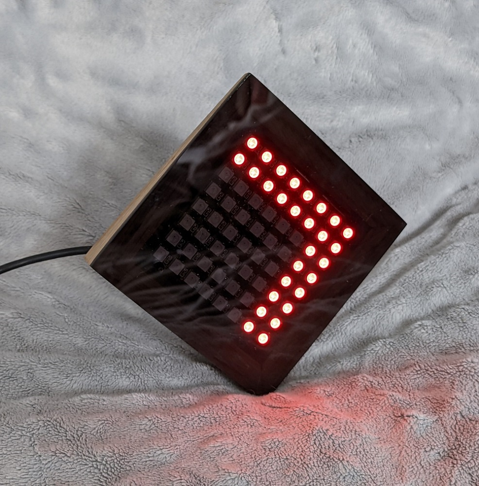
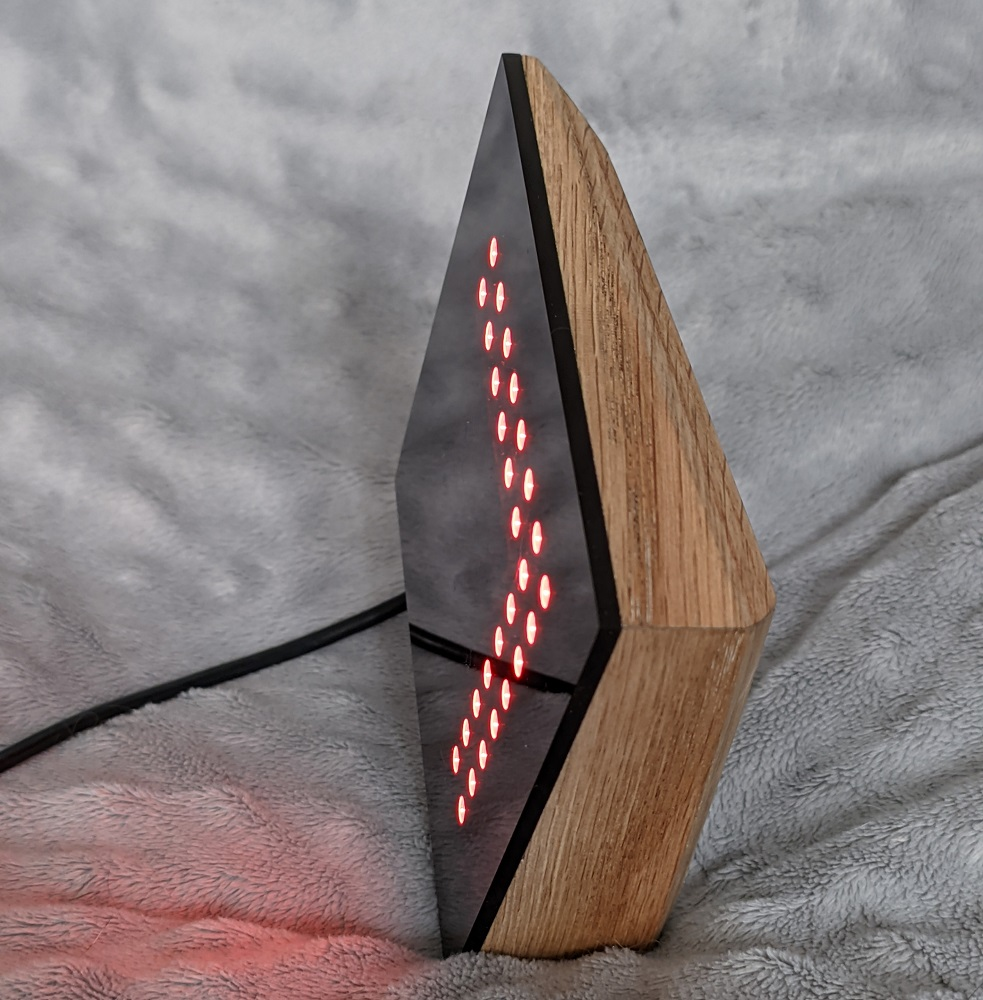

# CareLight ([wersja polska](./README_pl.md))
    

CareLight is a DIY project that provides a simple color LED indicator over WiFi for people with diabetes who use Medtronic's 740g/780g insulin pumps. It connects with Medtronic's CareLink cloud and downloads current glucose level data.

This project is still in its early development stage, and I might not be aware of all existing constraints. The project has been tested on a 740G pump and a CareLink account created for a patient based in Poland. Any tests or issues reported for other configurations are highly appreciated.

It's my free-time hobby project, so quick and extensive support is rather unlikely, but I'll try my best ;)

## Disclaimer and Warning

This project is for educational and informational purposes only and has not been approved by any medical authority (FDA, etc.). It is not properly tested and should not be used for making any medical treatment decisions. It is neither affiliated with nor endorsed by Medtronic, and may violate their Terms of Service. The use of this code is without warranty or any kind of support.

## License

This project is licensed under terms of [GNU General Public License v3.0](./LICENSE.md)

## Features
* Displays arrow indications with regard to the current glucose level and trend:
  * Eight different colors indicate glucose level, and there are seven thresholds between them.
  * Both colors and thresholds are user-defined.
  * There are easy-to-distinguish arrow types for glucose trend, such as single, double, and triple arrows.
* Displays indications about common connection problems:
  * WiFi connection problems
  * Internet connection problems or CareLink cloud availability
  * Connection problems between Medtronic pump and the CareLink cloud, such as a pump out of range or master cell phone connection problems
* Easy configuration through any terminal application over USB cable

## Hardware Requirements
* More informations about used hardware can be found [here](./Documents/Hardware.md).
* Controller board with ESP32 series WiFi/BT chip (best choice - ESP-WROOM-32)
* Display board with 8x8 WS2812B LEDs

## Software Requirements for Programming and Configuration:
* Arduino IDE >= 2.0.4 with:
  * ESP32 Arduino Core board support >= v2.0.4
  * FastLED library by Daniel Garcia >= v3.5
  * ArduinoJson library by Benoit Blanchon >= v6.21.1
  * StreamUtils library by Benoit Blanchon >= v1.7.3 (to be removed)
* USB-to-serial chip drivers (according to controller board - CH340G, CP2102, or other) 

## Constraints
Currently, CareLight works with:
* Medtronic 740G/780G insulin pumps connected with a base phone with Medtronic Minimed Mobile app.
* Glucose units set to mg/dL
* Users based on European CareLink servers (no US, and no China servers)
* CareLink user account without 2-factor authentication enabled.

## Setup and Manual
* Setup and configuration process is explained [here](./Documents/Setup.md).
* Short manual can be found [here](./Documents/Manual.md).
