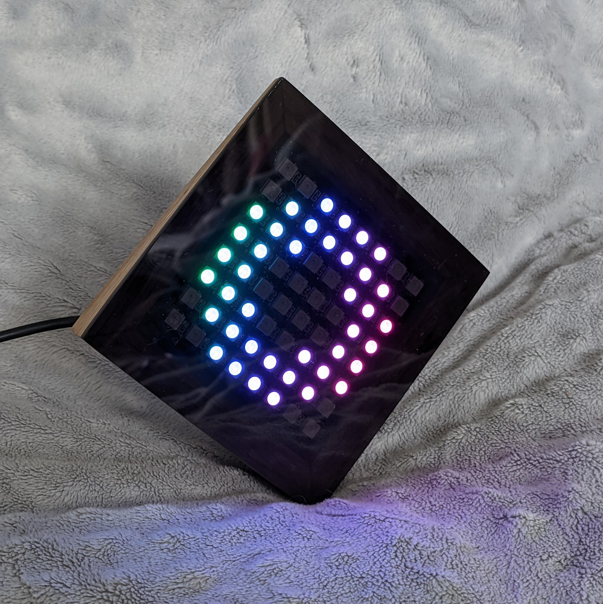

# CareLight
    

CareLight to wyświetlacz LED z obsługą WiFi do wskazywania bieżącego poziomu i trendu glukozy dla osób z cukrzycą korzystających z pomp insulinowych 740g/780g firmy Medtronic. Urządzenie łączy się z chmurą CareLink, z której pobierane są aktualne dane.

Projekt jest w fazie wczesnego rozwoju i może istnieć wiele ograniczeń, których jeszcze nie znam. Urządzenie zostało przetestowane na pompie 740G i koncie CareLink stworzonym dla pacjenta w Polsce. Wszelkie testy i raportowane problemy związane z innymi konfiguracjami będą bardzo pomocne.

Jest to mój projekt po godzinach, więc szybkie i profesjonalne wsparcie techniczne jest mało prawdopodobne, ale postaram się robić co w mojej mocy ;)

## Ostrzeżenie

Ten projekt jest przeznaczony wyłącznie do celów edukacyjnych i informacyjnych. Nie został zatwierdzony przez żadne organy medyczne (takie jak FDA, NFZ itp.). Nie jest odpowiednio przetestowany i nie powinien być używany do podejmowania jakichkolwiek decyzji dotyczących leczenia. Nie jest związany ani nie jest popierany przez firmę Medtronic i może naruszać jej warunki korzystania z usług. Korzystanie z tego kodu odbywa się bez gwarancji lub jakiejkolwiek formy wsparcia.

## Licencja

Ten projekt jest objęty licencją [GNU General Public License v3.0](./LICENSE.md)

## Funkcje
* Wyświetla wskaźniki strzałkowe związane z aktualnym poziomem glukozy i trendem:
  * Używa 8 różnych kolorów wskazujących na poziom glukozy i 7 progów przełączania między nimi
  * Zarówno kolory, jak i wartości progowe są definiowane przez użytkownika
  * Używa różnych typów strzałek zależności od tempa zmian poziomu glukozy (trendu) - pojedynczych, podwójnych i potrójnych
* Wyświetla informacje o najczęstszych problemach z połączeniem:
  * Problemy z połączeniem WiFi
  * Problemy z połączeniem z internetem lub dostępnością chmury CareLink
  * Problemy z połączeniem między pompą Medtronic a chmurą CareLink, takie jak: pompa poza zasięgiem, problemy z połączeniem z bazowym telefonem komórkowym
* Łatwa konfiguracja za pomocą dowolnej aplikacji terminalowej przez kabel USB

## Wymagania sprzętowe
* Więcej informacji na temat używanego sprzętu można znaleźć [tutaj](./Documents/Hardware_pl.md).
* Płytka główna z chipem ESP32 WiFi/BT (najlepszy wybór - ESP-WROOM-32)
* Płytka wyświetlacza z 8x8 diodami LED WS2812B

## Wymagania programowe dla programowania i konfiguracji:
* Arduino IDE >= 2.0.4 wraz z:
  * ESP32 Arduino Core board support >= v2.0.4
  * FastLED library by Daniel Garcia >= v3.5
  * ArduinoJson library by Benoit Blanchon >= v6.21.1
  * StreamUtils library by Benoit Blanchon >= v1.7.3 (do usunięcia)
* Sterowniki chipa USB-to-serial (odpowiednio do płytki głównej - CH340G, CP2102 lub inny) 

## Ograniczenia
Obecnie CareLight działa z:
* Pompami insulinowymi Medtronic 740G/780G podłączonymi do bazowego telefonu z aplikacją mobilną Medtronic Minimed Mobile
* Jednostkami glukozy ustawionymi na mg/dL
* Użytkownikami korzystającymi z serwerów europejskich CareLink (bez USA i Chin)
* Kontami użytkowników CareLink bez włączonej autoryzacji dwuskładnikowej

## Konfiguracja i instrukcja obsługi
* Proces konfiguracji i programowania jest opisany [tutaj](./Documents/Setup_pl.md).
* Krótka instrukcja obsługi znajduje się [tutaj](./Documents/Manual_pl.md).
